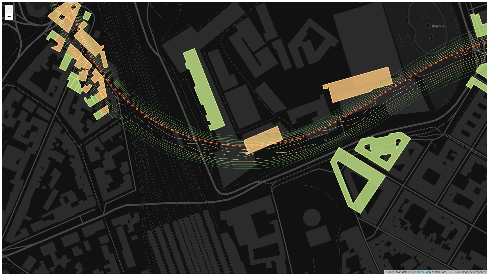

## Geojson Contour Plot Example

An example of geojson displayed as contour plot



This HTML/JS example renders on a Leaflet Map four (4) different geojson files exported from existing vector layers (QGIS). 

The geojson data are the result of a Building Risk Assessment based on a digital model describing Tunneling-induced Ground Settlements.

### The background is using GeoJSON with Leaflet

Use L.geoJSON(geojsondata) as explained in  [Leaflet documentation](https://github.com/Leaflet/Leaflet/blob/master/docs/examples/geojson/index.md)

For example:

```
        L.geoJSON(geojsondata, {
            onEachFeature: function (feature, layer) {
                if (feature.properties && feature.properties.label) {
                    // Edit here for an improved popup
                    var popupContent = "label = " + feature.properties.label;
                    layer.bindPopup(popupContent);
                }
            }
        }).addTo(mymap);
```

### The Example

The code is plain HTML and Javascript, you can see the result here [index.html](https://danzi-tn.github.io/geojson_contourplot/)

Clone this repository

```
git clone https://github.com/danzi-tn/geojson_contourplot.git
```

If you have python installed on your linux box you can run the page on a local webserver (in run_python_http.sh you can change port 8888 as you prefer), othewise you have to upload the content of geojson_contourplot to your public_html Apache/Nginx directory

```
cd geojson_contourplot
./run_python_http.sh
```

and visit [http://localhost:8888/](http://localhost:8888/)

### The Code

#### Geojson files
Each file contain a single FeatureCollection, i.e. groups of related features combined together.

The alignment's file contains a collection of LineString representing the tunnel track.
```
data/alignments.geojson
```

The profile's file contains a collection of Point representing the sequence of tunnel's chainages (PKs).
```
data/profile_D1.geojson
```

The contour's file contains a collection of MultiLineString representing ground settlements calculated along the tunnel's track.
```
data/D1_contour.geojson
```

The buildings' file contains a collection of MultiPolygon representing the buildings located near the tunnel's track.
```
data/buildings_data.geojson
```

#### index.html and related js

First of all load the ```css``` and ```js``` required for using Leaflet and JQuery 

```
  <!-- Leaflet's CSS -->
    <link rel="stylesheet" href="https://unpkg.com/leaflet@1.3.1/dist/leaflet.css" integrity="sha512-Rksm5RenBEKSKFjgI3a41vrjkw4EVPlJ3+OiI65vTjIdo9brlAacEuKOiQ5OFh7cOI1bkDwLqdLw3Zg0cRJAAQ=="
        crossorigin="" />

    <!-- Leaflet's javascript, make sure you put this AFTER Leaflet's CSS -->
    <script src="https://unpkg.com/leaflet@1.3.1/dist/leaflet.js" integrity="sha512-/Nsx9X4HebavoBvEBuyp3I7od5tA0UzAxs+j83KgC8PU0kgB4XiK4Lfe4y4cgBtaRJQEIFCW+oC506aPT2L1zw=="
        crossorigin=""></script>

    <!-- jquery  -->
    <script src="https://code.jquery.com/jquery-3.3.1.min.js" integrity="sha256-FgpCb/KJQlLNfOu91ta32o/NMZxltwRo8QtmkMRdAu8="
        crossorigin="anonymous"></script>
```

```service.js``` contains some js functions I prefer to keep separate from ```index.html```

```
    <!-- provides local service and functions  -->
    <script src="js/service.js" type="text/javascript"></script>
```


