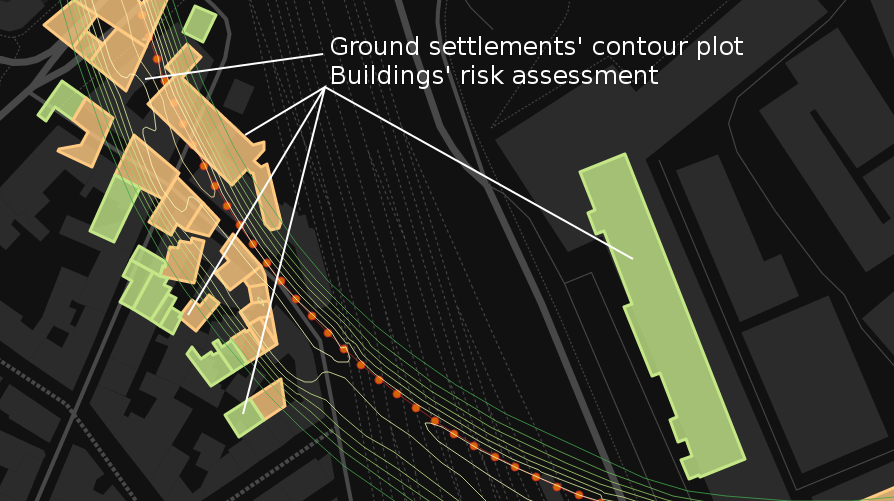

## Geojson Contour Plot Example

An example of geojson displayed as contour plot



### The background is using GeoJSON with Leaflet

Use L.geoJSON(geojsondata) as explained in  [Leaflet documentation](https://github.com/Leaflet/Leaflet/blob/master/docs/examples/geojson/index.md)

For example:

```
        L.geoJSON(geojsondata, {
            onEachFeature: function (feature, layer) {
                if (feature.properties && feature.properties.label) {
                    // Edit here for an improved popup
                    var popupContent = "label = " + feature.properties.label;
                    layer.bindPopup(popupContent);
                }
            }
        }).addTo(mymap);
```

### The code

The code is plain HTML and Javascript, you can see the result here [index.html](https://danzi-tn.github.io/geojson_contourplot/)

Clone this repository

```
git clone https://github.com/danzi-tn/geojson_contourplot.git
```

If you have python installed on your linux box you can run the page on a local webserver (in run_python_http.sh you can change port 8888 as you prefer), othewise you have to upload the content of geojson_contourplot to your public_html Apache/Nginx directory

```
cd geojson_contourplot
./run_python_http.sh
```

and visit [http://localhost:8888/](http://localhost:8888/)


